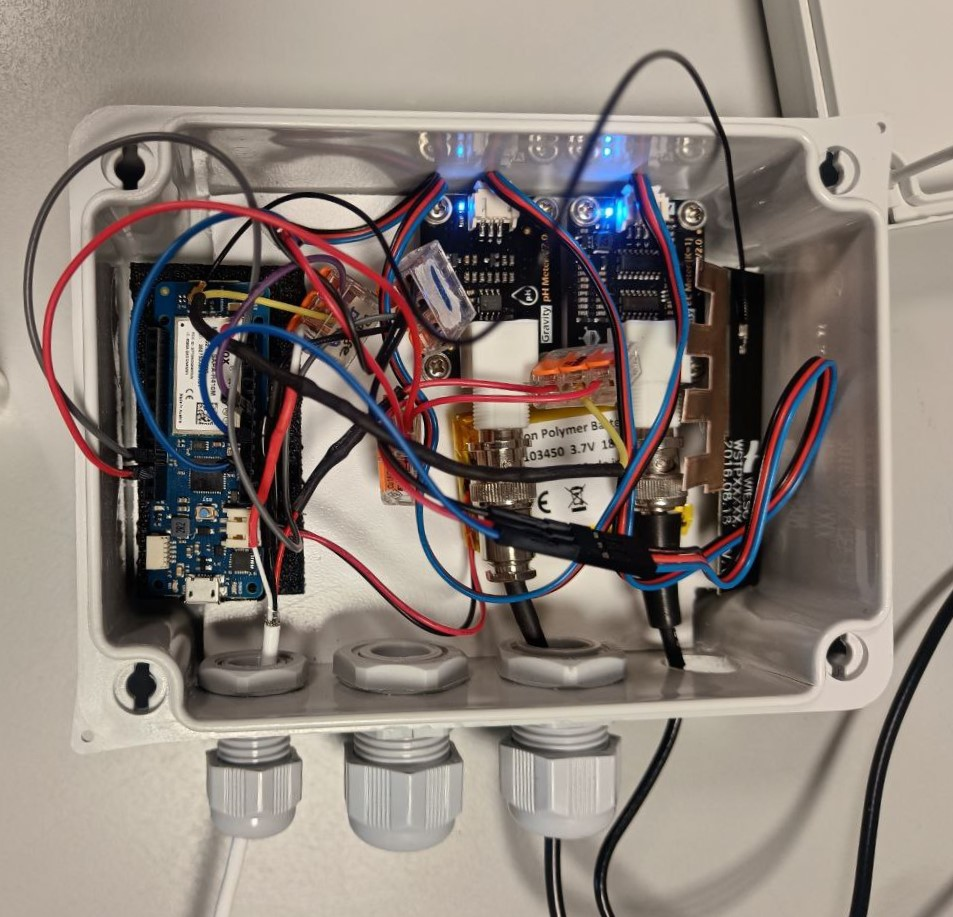
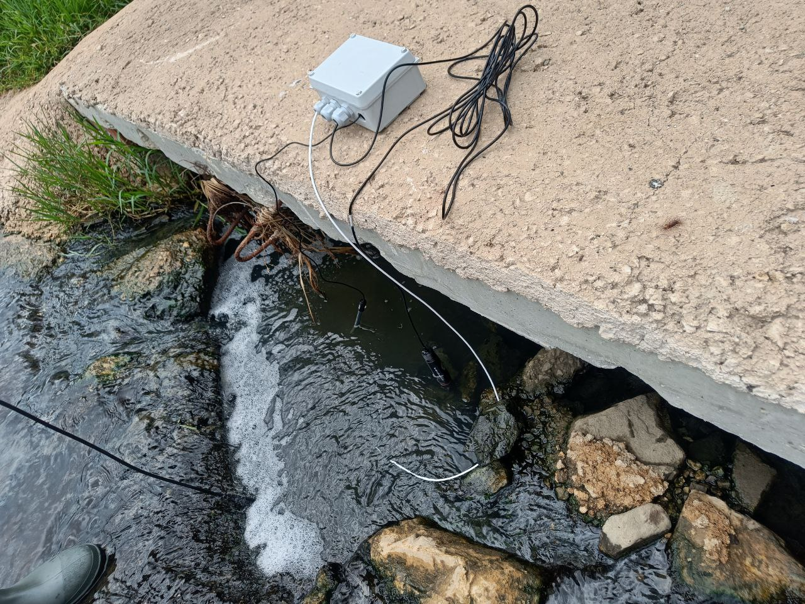

# Arduino Soft-Sensor MQTT Device Code

This project demonstrates an Arduino-based soft-sensor device that reads environmental data (temperature, pH, and electrical conductivity) and publishes it to an MQTT server over NB-IoT and GPRS networks. 

You can find more information about Kafka-ML and the methodology in the following [open-access publication](TBD)

If you use this code or the methodology in your research, please cite one of the following jobs:

```bibtex
@article{chaves2024softsensor,
    title={A soft sensor open-source methodology for inexpensive monitoring of water quality: a case study of NO3 concentrations},
    author={Chaves, A.J., et al.},
    journal={TBD},
    year={2024},
    volume={-},
    pages={-},
    doi={-}
}

@incollection{chaves2023methodology,
  title={A methodology for the development of soft sensors with Kafka-ML},
  author={Chaves, Antonio Jes{\'u}s and Mart{\'\i}n, Cristian and Torres, Luis Llopis and Soler, Enrique and D{\'\i}az, Manuel},
  booktitle={Data Analytics for Internet of Things Infrastructure},
  pages={307--324},
  year={2023},
  publisher={Springer}
}
```

## Images
### Hardware setup



### Deployment example




## Table of Contents
- [Arduino Soft-Sensor MQTT Device Code](#arduino-soft-sensor-mqtt-device-code)
  - [Images](#images)
    - [Hardware setup](#hardware-setup)
    - [Deployment example](#deployment-example)
  - [Table of Contents](#table-of-contents)
  - [Features](#features)
  - [Hardware Used](#hardware-used)
  - [Software Requirements](#software-requirements)
  - [Wiring Diagram](#wiring-diagram)
  - [Installation](#installation)
  - [Usage](#usage)
  - [Code Overview](#code-overview)
    - [`setup()`](#setup)
    - [`initializeNB_GPRS()`](#initializenb_gprs)
    - [`reconnectMQTT()`](#reconnectmqtt)
    - [`read_temperature()`](#read_temperature)
    - [`read_sensor_data()`](#read_sensor_data)
    - [`loop()`](#loop)
    - [`readSerial(char result[])`](#readserialchar-result)
  - [Contributing](#contributing)
  - [License](#license)

## Features
- Reads temperature, pH, and electrical conductivity (EC) data.
- Publishes sensor data to an MQTT server.
- Utilizes NB-IoT and GPRS for communication.
- Low power consumption with sleep mode.

## Hardware Used
- Arduino MKR NB 1500
- DFRobot pH sensor (DFR0300)
- DFRobot EC sensor (SEN0169-V2)
- Adafruit Temperature sensor (642-DS18B20)
- Multiprotocol Antenna (FXUB63.07.0150C)
- SIM card with NB-IoT and GPRS support

## Software Requirements
- Arduino IDE
- MKRNB Library
- MQTT Library
- OneWire Library
- DallasTemperature Library
- MKR_DFRobot_EC Library
- MKR_DFRobot_PH Library
- ArduinoLowPower Library

## Wiring Diagram
Connect the sensors to the Arduino MKR board as follows:
- **pH Sensor**: Analog pin A4
- **EC Sensor**: Analog pin A2
- **Temperature Sensor**: Analog pin A6

## Installation
1. **Clone the repository:**
    ```sh
    git clone https://github.com/ertis-research/arduino-softsensor-kafkaml.git
    ```
2. **Open the project in Arduino IDE:**
    ```sh
    arduino arduino-softsensor-kafkaml/NB_SendDataKafkaML.ino
    ```
3. **Install the required libraries** via the Arduino Library Manager:
    - MKRNB
    - MQTT
    - OneWire
    - DallasTemperature
    - DFRobot_EC (you may need to modify these libraries to work with the MKR NB 1500 board, as it works at 3.3v instead of 5v)
    - DFRobot_PH (you may need to modify these libraries to work with the MKR NB 1500 board, as it works at 3.3v instead of 5v)
    - ArduinoLowPower

4. **Update the `secrets.h` file** with your credentials:
    ```cpp
    #define SECRET_SIM_PINNUMBER "your_sim_pin"
    #define SECRET_SIM_APN "your_apn"
    #define MQTT_SERVER "your_mqtt_server"
    #define MQTT_PORT your_mqtt_port
    #define MQTT_USER "your_mqtt_username"
    #define MQTT_PASSWORD "your_mqtt_password"
    ```

## Usage
1. **Upload the code** to your Arduino MKR board.
2. **Open the Serial Monitor** at 115200 baud rate to observe the debug messages.
3. **Monitor the sensor data** being published to your MQTT server.

## Code Overview

### `setup()`
Initializes serial communication and sets up the MQTT client.

### `initializeNB_GPRS()`
Attempts to connect to the NB-IoT and GPRS network until a connection is established.

### `reconnectMQTT()`
Attempts to connect to the MQTT server until a connection is established.

### `read_temperature()`
Reads and returns the temperature in Celsius from the DallasTemperature sensor.

### `read_sensor_data()`
Reads temperature, pH, and EC sensor data, compensates pH and EC values with the temperature, performs sensor calibration if needed, and returns the formatted sensor data.

### `loop()`
Main loop function that initializes the network connection, connects to the MQTT server, reads sensor data, publishes it to the MQTT topic, and then puts the device to sleep.

### `readSerial(char result[])`
Reads a line from the serial input into the provided result array. Used for calibration commands.

## Contributing
Contributions are welcome! Please fork the repository and submit a pull request for any enhancements or bug fixes.

## License
This project is licensed under the MIT License. See the [LICENSE](LICENSE) file for details.

---

*Happy Coding!* :rocket:
